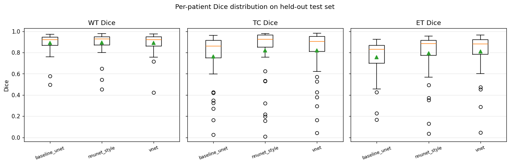
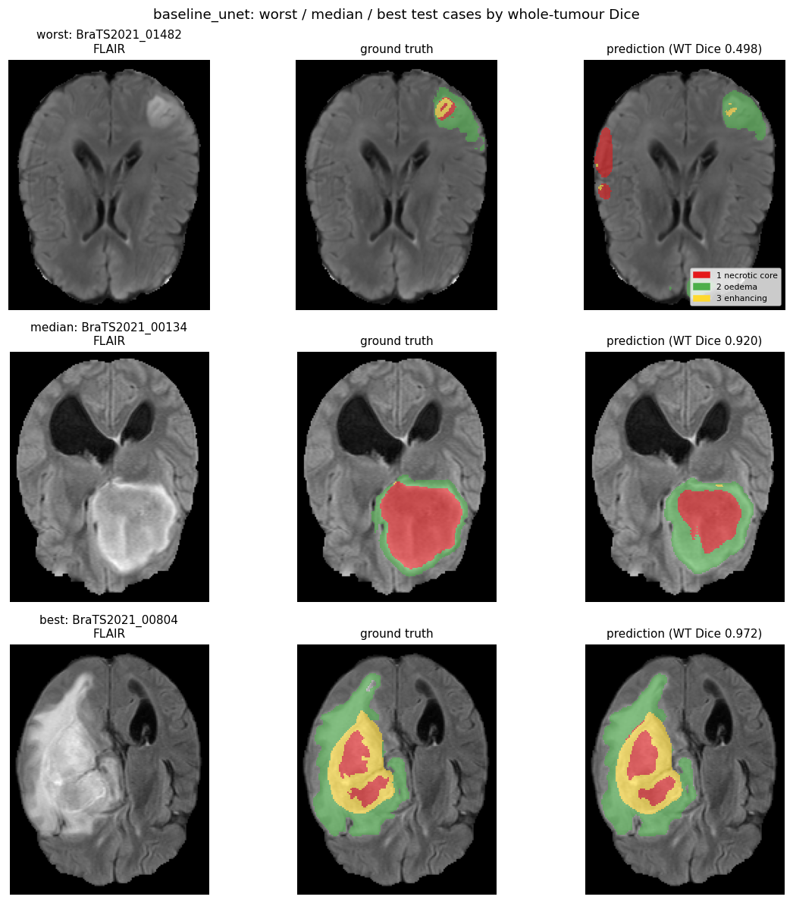
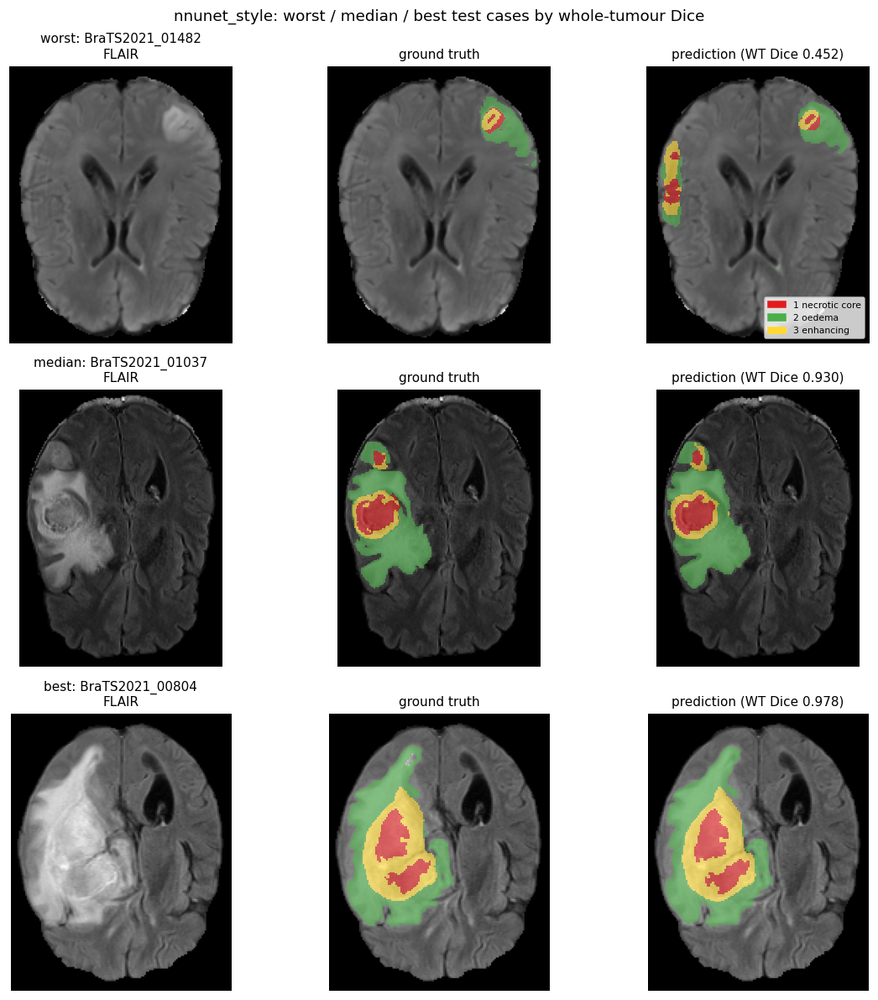
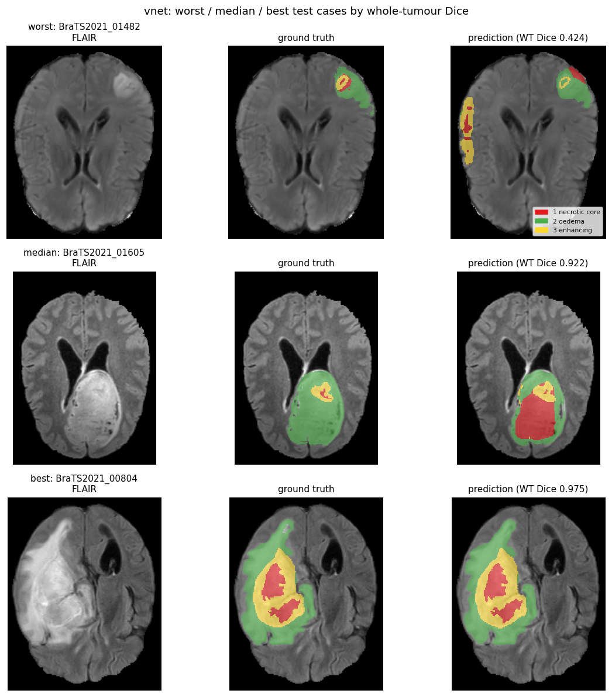
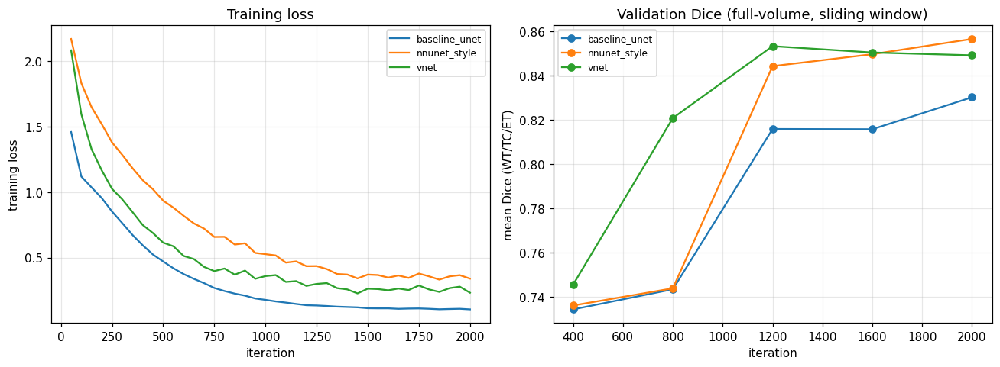

# BraTS 2021 — Brain Tumour Segmentation

3D segmentation of brain tumours in multi-modal MRI, built end to end: data acquisition and
validation, a preprocessing cache, patch-based training, sliding-window inference, and per-region
evaluation against the metrics the BraTS challenge actually scores.

Three configurations are trained and compared under an identical budget, so the comparison is
between methods rather than between amounts of compute.

> **Compute budget, stated up front.** Everything here was trained on a single RTX 4070 Laptop
> (8.6 GB VRAM) in about **25 minutes of total GPU time**, on a 300-patient subset. Published BraTS
> results come from multi-day runs on the full 1,251 patients, and the numbers below are
> correspondingly lower. Every figure in this repository was measured by the scripts in it —
> nothing is copied from a paper or estimated.

---

## Results

Held-out test set: **45 patients**, never seen during training or model selection. Dice is mean ± standard deviation **across patients** — it describes case-to-case variability, not a seed-to-seed error bar (one seed per config).

| Model | Params | Dice WT | Dice TC | Dice ET | HD95 WT (vox) | Inference |
|---|---|---|---|---|---|---|
| nnU-Net-style U-Net | 5.6M | **0.893 ± 0.105** | **0.821 ± 0.251** | 0.793 ± 0.211 | **10.7** | **0.52s** |
| V-Net | 7.8M | 0.890 ± 0.095 | 0.819 ± 0.225 | **0.809 ± 0.183** | 12.6 | 0.55s |
| Baseline U-Net | 5.6M | 0.890 ± 0.093 | 0.765 ± 0.228 | 0.755 ± 0.170 | 12.5 | 0.53s |

### Which differences are real

Per-patient Dice varies far more (σ ≈ 0.10–0.25) than the gap between models, so eyeballing the means above is not enough. Every config is evaluated on the *same* patients, so the comparison is **paired** — which removes between-patient variance and asks the question that matters: on a given patient, is one model better? Wilcoxon signed-rank is reported alongside the t-test because per-patient Dice is left-skewed and bounded at 1.

| Comparison | Region | Δ Dice | 95% CI | Wilcoxon p | Better on |
|---|---|---|---|---|---|
| nnU-Net-style U-Net vs Baseline U-Net | WT | +0.003 | [-0.007, +0.013] | **0.0098** | 32/45 |
|  | TC | +0.056 | [+0.020, +0.092] | **0.0000** | 39/45 |
|  | ET | +0.038 | [+0.004, +0.073] | **0.0000** | 40/45 |
| V-Net vs Baseline U-Net | WT | +0.000 | [-0.009, +0.009] | 0.561 | 27/45 |
|  | TC | +0.054 | [+0.028, +0.081] | **0.0000** | 38/45 |
|  | ET | +0.054 | [+0.039, +0.069] | **0.0000** | 42/45 |

**What this actually says.** The configuration bundle (per-modality z-scoring, Dice+CE, augmentation, deep supervision) buys **nothing measurable on whole tumour** — all three models sit within 0.003 of each other there — but a real **+0.04 to +0.05 on tumour core and enhancing tumour**. That is the sensible direction: whole tumour is large and high-contrast on FLAIR, so even a weak configuration finds it, and the harder small structures are where loss function and normalisation earn their keep. Reporting only the headline WT number would have hidden the entire effect.

The two strong configs are statistically indistinguishable from each other on this test set; with one seed apiece, the honest reading is a tie.

### Training cost

| Config | Iterations | Wall clock | Best val Dice |
|---|---|---|---|
| nnU-Net-style U-Net | 2000 | 8.3 min | 0.857 |
| V-Net | 2000 | 9.0 min | 0.853 |
| Baseline U-Net | 2000 | 7.9 min | 0.830 |

**Total training time: 25 minutes** on one RTX 4070 Laptop.

### Figures

**Per-patient Dice distribution**



**Baseline U-Net: worst / median / best test cases**



**nnU-Net-style: worst / median / best test cases**



**V-Net: worst / median / best test cases**



**Training loss and validation Dice**



---

## Observed failure modes

Taken from the worst test cases in the figures above, not from speculation.

**Contralateral false positives.** The clearest failure (`BraTS2021_01482`, WT Dice 0.452) is not a
missed tumour — the real lesion is segmented reasonably well. The model additionally invented a
second lesion in the opposite hemisphere, where the ground truth has nothing. FLAIR hyperintensity
from non-tumour causes (small-vessel disease, gliosis, normal periventricular signal) looks similar
to oedema locally, and a `128³` patch does not always contain enough context to tell them apart.
A whole-brain consistency constraint, or simply more training data, would be the place to attack
this.

**Enhancing tumour is bimodal, not uniformly mediocre.** The per-patient distribution shows the
model either finds the enhancing core or largely misses it — the mean of ~0.79 is an average over
two modes, not a typical case. This is why the standard deviation on ET (0.21) is roughly double
that on whole tumour (0.10), and it is the strongest argument for reporting the distribution rather
than the mean alone.

**Boundary precision lags overlap.** HD95 of 10–13 voxels is high relative to published BraTS
results (~5–8). Dice rewards getting the bulk of a region right; HD95 punishes the worst boundary
excursion. The gap between the two is where the short training budget shows most clearly.

---

## What the model is asked to do

Four MRI sequences are acquired per patient. Each makes different tissue visible, and the tumour is
only separable when they are read together:

| Sequence | What it shows |
|---|---|
| FLAIR | Oedema — the swelling that spreads well beyond the tumour itself |
| T1 | Anatomy, the structural reference |
| T1ce | T1 with contrast agent; the active tumour takes up contrast and lights up |
| T2 | Additional soft-tissue contrast |

BraTS is **not scored per label**. It is scored on three *nested* regions, and the model is
evaluated the same way:

| Region | Composition | Clinical meaning |
|---|---|---|
| **WT** — whole tumour | labels 1 + 2 + 3 | Full extent of the disease |
| **TC** — tumour core | labels 1 + 3 | The tumour without surrounding oedema; what a surgeon targets |
| **ET** — enhancing tumour | label 3 | Actively growing tissue; the region that tracks treatment response |

ET is the smallest and hardest region, and it is where scores are lowest for every model here. That
is the expected ordering, not an anomaly — it is a few cm³ of tissue inside a 1.5-litre volume.

---

## Pipeline

```
brats2021_download_and_check.ipynb   Download 1,251 patients from Kaggle, verify all 5 files
          |                          per patient and every volume shape, write a manifest CSV
          v
scripts/build_cache.py               Crop to brain, remap label 4 -> 3, store float16 .npy
          |                          (~4 min for 300 patients; removes .nii.gz decompression
          v                           from the training loop, which otherwise starves the GPU)
scripts/train.py                     Patch-based training, AMP, cosine LR, full-volume validation
          |
          v
scripts/evaluate.py                  Sliding-window inference on held-out patients,
          |                          per-region Dice / HD95 / sensitivity / specificity
          v
scripts/make_figures.py              Training curves, Dice distributions, worst/median/best cases
```

### Design decisions that mattered

**Patch-based training.** A full volume is `4 × 240 × 240 × 155` — about 142 MB per sample in
float32. Training on whole volumes does not fit in 8 GB of VRAM at any usable batch size. The model
trains on `128³` patches and reassembles full predictions at inference with a sliding window.

**Tumour-biased patch sampling.** Tumour is roughly 2–4% of brain voxels. Uniformly random `128³`
patches would mostly contain no tumour at all, and a short run would spend its whole budget
learning to output zeros. Half of all sampled patches are centred on a tumour voxel.

**Gaussian-weighted window blending.** Voxels near a patch border are predicted with less
surrounding context, so overlapping windows are blended by distance from the patch centre rather
than averaged uniformly. Flat averaging leaves visible grid seams at patch boundaries.

**InstanceNorm, not BatchNorm.** Batch size is 2 at this patch size. BatchNorm statistics estimated
from two samples are noise.

**Dice + cross-entropy.** CE alone is dominated by the ~96% background voxels. The Dice term is
computed over foreground channels only.

**Splitting by patient.** Two patches from the same brain are near-duplicates. Splitting by patch
or by slice leaks the test set into training and inflates scores dramatically. The split here is by
patient, fixed by seed, and applied before anything else touches the data.

---

## The three configurations

`baseline_unet` and `nnunet_style` share the same architecture and differ only in preprocessing,
loss and augmentation, so the gap between them measures that **bundle** of choices. It is not an
attribution to any single one of them — separating those would take three more training runs, which
this compute budget does not cover. This is stated rather than presented as a per-factor ablation
that was not performed.

| Config | Architecture | Normalisation | Loss | Augmentation | Deep supervision |
|---|---|---|---|---|---|
| `baseline_unet` | 3D U-Net | min-max | CE only | none | no |
| `nnunet_style` | 3D U-Net | per-modality z-score | Dice + CE | flips, intensity jitter | yes |
| `vnet` | V-Net (residual) | per-modality z-score | Dice + CE | flips, intensity jitter | no |

**On the name `nnunet_style`:** this implements nnU-Net's *design principles* — patch-based
training, per-modality z-scoring over brain voxels, Dice+CE, deep supervision, aggressive
augmentation. It is **not** the [nnU-Net framework](https://github.com/MIC-DKFZ/nnUNet) and does not
use its self-configuration. Calling it "nnU-Net" would overstate what was done.

---

## Reproducing this

```bash
# 1. Environment
python -m venv .venv
.venv/Scripts/activate           # Linux/macOS: source .venv/bin/activate
pip install -r requirements.txt

# 2. Data (~30 GB unpacked). Needs a Kaggle API token in ~/.kaggle/access_token
jupyter notebook brats2021_download_and_check.ipynb

# 3. Preprocessing cache (~4 min, ~10 GB)
python scripts/build_cache.py --n 300

# 4. Train all three configurations (~25 min total on an RTX 4070 Laptop)
ITERS=2000 ./scripts/run_all.sh

# 5. Evaluate on held-out patients and render figures
python scripts/evaluate.py
python scripts/compare_configs.py   # paired significance tests between configs
python scripts/make_figures.py
python scripts/update_readme.py     # regenerates the Results section above
```

Individual runs:

```bash
python scripts/train.py --config nnunet_style --iters 2000
python scripts/evaluate.py --configs nnunet_style --limit 10
```

### Reproducibility

| | |
|---|---|
| Seed | `42`, fixed across data split, patch sampling, and weight init |
| Split | By patient, deterministic from the seed — never by slice or patch |
| Hyperparameters | All in `src/config.py`; the full set is also written into each `logs/*_history.json` |
| Logged per run | Every hyperparameter, loss curve, validation curve, wall-clock time, GPU name |
| Test set | Held out; touched only by `scripts/evaluate.py`, never during training or model selection |

**What the ± means:** standard deviation **across test patients**, from a single training run. It
describes case-to-case variability. It is *not* a seed-to-seed error bar — only one seed was trained
per configuration, and claiming otherwise would misrepresent the experiment.

---

## Project layout

```
brats2021_download_and_check.ipynb   Data acquisition and integrity checking (1,251 patients)
notebooks/
  01_eda.ipynb                       Class imbalance, tumour volume distribution, modalities
  02_results.ipynb                   Renders measured results; computes nothing new
src/
  config.py                          All hyperparameters and the three configuration definitions
  data.py                            Patient-level split, patch sampling from the cache
  preprocessing.py                   Brain cropping, per-modality normalisation, augmentation
  models.py                          3D U-Net (optional deep supervision), V-Net
  losses.py                          Dice+CE, deep-supervision wrapper
  metrics.py                         Region definitions, Dice, HD95, sensitivity/specificity
  inference.py                       Sliding-window inference, per-voxel ensembling
scripts/
  build_cache.py                     .nii.gz -> cropped float16 .npy
  train.py                           Training loop
  evaluate.py                        Test-set evaluation
  compare_configs.py                 Paired t-test / Wilcoxon between configurations
  make_figures.py                    Figures
  update_readme.py                   Regenerates the Results section from measured output
  run_all.sh                         Trains all three configurations
```

---

## Using the trained model

```python
import torch
from src.config import NUM_CLASSES, get_device
from src.models import create_model
from src.data import load_case
from src.inference import predict_case
from src.metrics import evaluate_segmentation

device = get_device()
ckpt = torch.load("checkpoints/nnunet_style_best.pt", map_location=device, weights_only=False)
cfg = ckpt["settings"]

model = create_model(cfg["model"], base_channels=cfg["base_channels"],
                     deep_supervision=cfg["deep_supervision"],
                     num_classes=NUM_CLASSES, device=device)
model.load_state_dict(ckpt["model"])

img, seg = load_case("BraTS2021_00495")
pred = predict_case(model, img, normalization=cfg["normalization"], device=device)

print(evaluate_segmentation(pred, seg)["WT"])
print(f"whole-tumour volume: {(pred > 0).sum() / 1000:.1f} cm3")
```

---

## Limitations

These are the honest boundaries of what was done here.

- **Compute-limited.** ~10 minutes of training per model on 210 patients. Published BraTS results
  come from days of training on the full set. The gap is budget, not method.
- **One seed per configuration.** No seed-to-seed error bars, so small differences between
  configurations should not be over-read.
- **300 of 1,251 patients cached.** The remaining patients are downloaded and verified but unused.
- **No external validation.** Trained and tested within BraTS 2021 only. Performance on data from
  other scanners, protocols or populations is unmeasured, and medical imaging models are known to
  degrade across sites.
- **Not a clinical tool.** Research code. No regulatory validation of any kind.
- **HD95 is undefined** when a region is empty in one mask but not the other; those cases are
  excluded from the HD95 average, and the count of contributing patients is recorded in
  `results/summary.json`.

## Possible next steps

- Train on all 1,251 patients with a longer schedule
- Separate the bundled ablation into individual factors
- Multiple seeds for genuine error bars
- Test-time augmentation, typically worth a few points of Dice
- 5-fold cross-validation instead of a single held-out split

---

## Data

Baid et al., *The RSNA-ASNR-MICCAI BraTS 2021 Benchmark on Brain Tumor Segmentation and
Radiogenomic Classification*, arXiv:2107.02314.
Accessed via the Kaggle mirror `dschettler8845/brats-2021-task1`.

```bibtex
@article{baid2021rsna,
  title={The RSNA-ASNR-MICCAI BraTS 2021 Benchmark on Brain Tumor Segmentation and Radiogenomic Classification},
  author={Baid, Ujjwal and others},
  journal={arXiv preprint arXiv:2107.02314},
  year={2021}
}
```

## License

MIT
